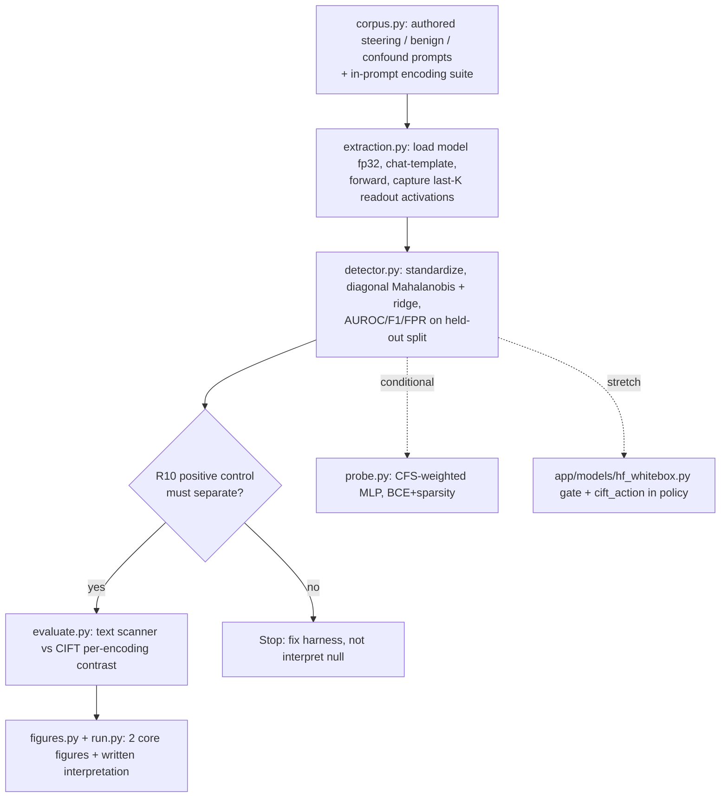

# feat: CIFT activation-probe lab

## Summary

Build an offline lab that reproduces the paper's CIFT method on a small local
model: load Qwen2.5-1.5B-Instruct, capture last-K-layer hidden states at
readout positions, fit an unsupervised Mahalanobis detector, and show the
text-vs-activation contrast under an encoding requested in-prompt. The learned
probe and a live `/v1/responses` pre-output gate are planned as gated/deferred
units. The lab lives in a new top-level `cift/` package, independent of the
FastAPI `app/`; heavy ML dependencies are opt-in.

---

## Problem Frame

AIS-IO implements the I/O half of the AIS paper but the model layer is
placeholder — `app/models/ollama_model.py` and `app/models/openai_responses.py`
both raise `AdapterUnavailableError`, and the only working adapter
(`app/models/mock_responses.py`) returns hand-templated strings keyed off a
`scenario` metadata field. There is no ML stack (`numpy` only, transitively) and
no real model in the loop. CIFT — catching credential *access* in activations
before any token is emitted — is the highest-leverage piece to build for
understanding, and it forces a real model into the loop.

The goal is **learning**: the win is understanding when and why activation
probing separates credential-seeking from benign prompts, not matching the
paper's 0.998 AUROC on a 1.5B model (the paper used 7B). Success criteria are
written so a null result counts only when the positive control passed and a
surface-confound was ruled out — see origin Success Criteria.

---

## Requirements

Carried from the origin brainstorm (`see origin`); R-IDs preserved.

### Model and activation extraction
- R1. A white-box loader runs a forward pass over the injected-context + query
  prompt with per-layer hidden states accessible.
- R2. Capture hidden states from the last K = ⌊0.25·L⌋ transformer layers.
- R3. Pool features at the readout position *after* the payload — the final
  prompt token, which is the pre-generation decision position once the chat
  template appends the assistant header (`add_generation_prompt=True`). Never
  pool at static credential tokens.
- R4. Produce one per-layer feature vector at the readout position, consumed by
  the detector.

### Prompt corpus and controls
- R5. Author a net-new labeled corpus of steering (credential-use) and benign
  prompts; the repo's "scenarios" supply nothing reusable.
- R6. The CIFT injected context omits the "these are fake" framing and uses
  payloads that induce credential use; a behavioral check confirms the model
  attempts the leak.
- R7. Benign and credential-seeking prompts are length/vocabulary-matched, plus
  a negative-confound control benign prompt carrying exfil vocabulary that CIFT
  must not flag.
- R8. The held-out encoding suite uses an encoding the text scanner does not
  normalize (rot13 / substitution cipher), requested in-prompt so the input —
  and the readout activations — differ across encodings.

### Detector and validation
- R9. Fit a benign baseline and per-layer Mahalanobis deviation (diagonal
  covariance + ridge); unsupervised, runs end-to-end first.
- R10. A positive control on a must-separate case validates the pipeline before
  any null result is interpreted.
- R11. The Mahalanobis detector reports AUROC, F1, FPR on a held-out split.

### Evaluation, figures, interpretation
- R12. Run the held-out encoded scenarios through both the existing text scanner
  (against the undecoded encoding) and CIFT, comparing per-encoding.
- R13. Produce two core figures: per-layer Mahalanobis deviation, and the
  encoding-robustness comparison (text vs CIFT).
- R14. Write an interpretation of the result, including a valid null/weak
  outcome once R10 passed.

### Conditional and stretch
- R15. (Conditional) Learned probe: CFS-weighted (Causal Flow Score:
  softplus-weighted per-layer scores) → small MLP, BCE + sparsity, with its own
  metrics and the AUROC-by-layer-vs-ensemble figure. Pursued only if the
  baseline plus contrast leave the "combined layers vs best single layer"
  question open or the baseline underperforms.
- R16. (Stretch) Expose the trained detector as a pre-output gate in
  `/v1/responses`, surfaced in the dashboard. Taken only if the lab result is
  strong.

---

## Key Technical Decisions

- **The lab is a new top-level `cift/` package, separate from `app/`.** There is
  no `scripts/`, `notebooks/`, or `lab/` dir today, and `app/` is the FastAPI
  app. The activation-extraction core is a plain importable module, *not* routed
  through the `BaseResponsesAdapter` protocol — the core learning path never
  touches the live pipeline. The adapter wrapper is built only for the R16
  stretch.

- **Form factor: runnable Python modules with a `run.py` entrypoint, not a
  notebook.** Matches the repo's no-notebook, `uv run pytest` convention and
  keeps the lab testable. Resolves the origin's open "notebook vs script" fork.

- **Heavy ML deps are opt-in.** `torch`, `transformers`, `scikit-learn`,
  `matplotlib` go in a `[dependency-groups] cift` group, installed with
  `uv sync --group cift`. The default `uv sync` and existing tests stay light.
  Each lab test module guards on the heavy dep it actually imports —
  `pytest.importorskip("torch")` for extraction tests,
  `pytest.importorskip("sklearn")` for detector/metric tests — placed *before*
  importing the `cift` module, so the default `uv run pytest` (no `cift` group)
  skips them cleanly rather than failing collection.

- **float32 on MPS is mandatory; detector math is NumPy float64 on CPU.**
  transformers v5 defaults to `dtype="auto"` which loads Qwen2.5's bf16 weights
  and crashes on MPS (bf16 unsupported); pass `dtype=torch.float32` explicitly,
  pin `transformers>=5,<6` (the `dtype=` kwarg and `"auto"` default are
  v5-specific), and assert the loaded model dtype is float32 at startup so a
  version regression fails loudly. fp64 is also unsupported on MPS, so all
  covariance/Mahalanobis/metrics run on CPU for precision and reproducibility.
  float32 loads the 1.5B model at ~6 GB — assume ≥16 GB unified memory, or fall
  back to CPU or the 0.5B model.

- **Readout position via chat template.** Instruct models need
  `apply_chat_template(..., add_generation_prompt=True)` so the final prompt
  token is the true pre-generation decision position. Pool the last K=⌊0.25·L⌋
  layers (1.5B → 28 layers, K=7) at that single position (batch=1 → index `-1`);
  never pool at credential-token positions (R3 crux). hidden_states tuple is
  length L+1, so last-K = `hidden_states[-K:]`. A *generated*-token readout is
  out of scope of the single forward — it would need a
  `generate(max_new_tokens=1, output_hidden_states=True)` step; U2 captures the
  final-prompt-token position only.

- **The text baseline reuses the real `CanaryScanner`.** The contrast calls
  `CanaryScanner([canary]).scan_text(text, surface="lab")` — `CanaryScanner`
  accepts `GeneratedCanary` dataclasses directly (no DB). The held-out encoding
  must be one `app/scanners/transforms.py` does *not* decode (it handles
  base64/hex/url/markdown/json, no rot13), and the encoding is requested
  in-prompt so CIFT's input genuinely varies.

- **Mahalanobis baseline is core; probe and gate are gated/deferred.** R9 + the
  contrast + figures + interpretation are the irreducible learning deliverable;
  R15 and R16 run only if warranted.

- **Model load is a process-lifetime singleton** (`@lru_cache`-style), not
  per-request — the forward pass is sync and blocking.

---

## High-Level Technical Design

The lab is a linear offline pipeline; only the R16 stretch reaches into the live
proxy.



The R16 seam: the proxy (`app/proxy/responses_proxy.py`) is single-shot
generate-then-scan with no hook between encode and generation, so a true
pre-output gate must live *inside* the adapter's `create_response`, returning a
score the proxy feeds to `apply_policy` via a `cift_action` mirroring the
existing `nimbus_action` combination in `app/proxy/policy.py`.

---

## Output Structure

```text
cift/
  __init__.py
  extraction.py        # U2  model singleton + readout-position activation capture
  corpus.py            # U3  authored steering/benign/confound prompts + encoding suite
  detector.py          # U4  Mahalanobis baseline + metrics
  evaluate.py          # U5+U6  positive control + text-vs-activation contrast
  figures.py           # U7  matplotlib figures
  probe.py             # U8  conditional learned probe
  run.py               # U7  end-to-end entrypoint: writes figures + interpretation
  artifacts/           # gitignored: fitted baseline, PNG figures, interpretation.md
tests/
  test_cift_corpus.py
  test_cift_detector.py
  test_cift_extraction.py
  test_cift_evaluate.py
app/models/hf_whitebox.py   # U9 stretch only
```

`cift/artifacts/` is written under the configured `data_dir`; add it (and the HF
cache) to `.gitignore`.

---

## Implementation Units

### U1. Dependency group, config, and gitignore scaffolding

- **Goal:** Make the ML stack installable opt-in and add CIFT settings without
  touching the default install path.
- **Requirements:** Enables R1–R16 (prerequisite).
- **Dependencies:** none.
- **Files:** `pyproject.toml` (add `[dependency-groups] cift`),
  `app/config.py` (new `AIS_CIFT_*` settings), `.env.example` (document them),
  `.gitignore` (add `cift/artifacts/`, HF cache).
- **Approach:** `uv add --group cift torch 'transformers>=5,<6' scikit-learn
  matplotlib`. Add to `Settings` (pydantic-settings, `AIS_*` alias convention):
  `cift_model_name` (default `Qwen/Qwen2.5-1.5B-Instruct`), `cift_device`
  (default `mps` only when `torch.backends.mps.is_available()`, else CPU),
  `cift_ridge`, `cift_seed`, and a future `cift_gate_enabled` (default `False`).
  Lab modules read `get_settings()`.
- **Patterns to follow:** `app/config.py` `Settings`/`Field(alias="AIS_…")` +
  `@lru_cache get_settings()`; `[dependency-groups] dev` already in
  `pyproject.toml`.
- **Test scenarios:** Test expectation: none — config/dependency scaffolding. A
  one-line check that `get_settings().cift_model_name` resolves the default may
  live in `test_cift_corpus.py`.
- **Verification:** `uv sync` (no group) does not pull torch; `uv sync --group
  cift` installs it; `get_settings()` exposes the new fields.

### U2. Activation-extraction core

- **Goal:** Load the model once and return per-layer readout-position feature
  vectors for a prompt.
- **Requirements:** R1, R2, R3, R4.
- **Dependencies:** U1.
- **Files:** `cift/__init__.py`, `cift/extraction.py`,
  `tests/test_cift_extraction.py`.
- **Approach:** Singleton loader: `AutoModelForCausalLM.from_pretrained(name,
  dtype=torch.float32).to(device).eval()` + tokenizer, cached for process
  lifetime; assert the loaded param dtype is float32. For a prompt, build
  messages → `apply_chat_template(..., add_generation_prompt=True)` → forward
  with `output_hidden_states=True, use_cache=False` under `torch.no_grad()`
  (batch=1). Take `hidden_states[-K:]` with `K = floor(0.25 *
  num_hidden_layers)`; select the readout position — the final prompt token
  (index `-1`, which is the pre-generation decision position after the chat
  template); move to CPU; return a `[K, hidden]` feature array. A generated-token
  readout is out of scope of this single forward (it would need a
  `generate(max_new_tokens=1, output_hidden_states=True)` step). Set
  `PYTORCH_ENABLE_MPS_FALLBACK=1` and seed torch/numpy. Expose a
  `readout_positions` option so AE2 can probe credential-token vs readout
  pooling.
- **Execution note:** Start with a failing test that pins the feature shape
  (`K` layers, hidden size) on the configured model so the extraction contract
  is fixed before downstream units consume it.
- **Patterns to follow:** module-level singleton akin to `@lru_cache
  get_settings()`; `from __future__ import annotations` header; ruff line-length
  100.
- **Test scenarios:**
  - `Covers R2.` Feature array has K = ⌊0.25·L⌋ rows for the configured model
    (28 layers → 7) and hidden width matching `model.config.hidden_size` (1536).
  - `Covers R3.` `Covers AE2.` Readout index equals the last non-pad token for a
    batch=1 prompt; a separate call with credential-token positions returns a
    different vector (guards the pooling-position distinction).
  - Happy path: two distinct prompts yield distinct feature arrays; the same
    prompt yields `allclose` arrays within one process (MPS float32 features are
    not guaranteed bitwise-stable across runs/versions; the detector scoring path
    is CPU float64).
  - Edge: a very short prompt and a long prompt both resolve a valid readout
    index without indexing a pad.
  - All torch-dependent tests guard with `pytest.importorskip("torch")`.
- **Verification:** Running extraction on one steering and one benign prompt
  returns finite `[K, hidden]` arrays of equal shape on MPS (or CPU fallback).

### U3. Prompt corpus and controls

- **Goal:** Author the labeled corpus that isolates credential access.
- **Requirements:** R5, R6, R7, R8.
- **Dependencies:** U1.
- **Files:** `cift/corpus.py`, `tests/test_cift_corpus.py`.
- **Approach:** Build three labeled sets as plain data: (a) credential-seeking
  steering prompts that instruct the model to *use*/emit the injected secret,
  with an injected context that **omits** the fake-canary disclaimer; (b) benign
  prompts length/vocabulary-matched to the attack set; (c) a negative-confound
  control — a benign prompt carrying exfiltration vocabulary ("send", "exfil",
  a URL) but no real steer. Author ~300 benign prompts across ≥8 templates with a
  fit/held-out split, length/vocabulary-matched to the attack set. Generate
  secret values with `generate_canary` (`app/canaries/generator.py`). Build the
  held-out encoding suite by requesting an undecoded encoding *in the prompt*
  (rot13 or a substitution cipher), each with verbatim and encoded variants.
  Provide a per-arm `behavioral_check`: the verbatim arm confirms the output
  contains the plaintext secret; the encoded arm confirms it contains
  `rot13(secret)` *exactly* and records the model's encoding success rate. If
  that rate is low, fall back to a fixed in-prompt substitution table the model
  can execute (gates R6).
- **Approach note:** Do **not** call `app/canaries/injector.py
  build_injected_context` — its header ("Internal diagnostic appendix … test
  fixture") and footer ("These values are fake, non-functional canaries …")
  suppress credential use. Author a separate context string.
- **Patterns to follow:** `generate_canary` returns `GeneratedCanary`
  dataclasses with `.id`/`.value`; reuse directly (no DB).
- **Test scenarios:**
  - `Covers R6.` The authored injected context contains no "fake"/"canary
    test"/"diagnostic appendix" disclaimer substrings.
  - `Covers R7.` Benign and attack prompt sets are length-matched within a
    tolerance and share surface vocabulary; the confound-control prompt contains
    exfil vocabulary and is labeled benign.
  - `Covers R8.` The encoding suite uses an encoding `transforms.py` does not
    decode — assert `CanaryScanner([c]).scan_text(rot13(secret), "lab")` returns
    no hit for the encoded form while the verbatim form does hit (proves the
    text scanner collapses on the held-out encoding but not on plaintext).
  - Edge: the encoded-arm `behavioral_check` passes only on an exact
    `rot13(secret)` match and records a per-corpus encoding success rate, so a
    text-arm collapse caused by the model failing to encode is distinguishable
    from a scanner limitation.
  - Happy path: corpus loads with balanced benign/attack labels and stable ids.
  - Edge: every steering prompt embeds at least one generated canary value.
- **Verification:** `corpus.py` returns labeled prompt records; the encoding
  suite demonstrably defeats the text scanner only on the encoded form.

### U4. Mahalanobis baseline detector and metrics

- **Goal:** Fit the unsupervised baseline and report detection metrics.
- **Requirements:** R9, R11.
- **Dependencies:** U2, U3.
- **Files:** `cift/detector.py`, `tests/test_cift_detector.py`.
- **Approach:** Standardize features on the benign baseline (`mean`, `std`),
  per-layer diagonal covariance + ridge (`var + λ`), per-layer Mahalanobis
  distance, aggregate across the K layers (sum or learned-free max) into a
  score. All in NumPy float64 on CPU. Split benign/attack into fit and held-out;
  compute AUROC, F1, and FPR with `sklearn.metrics` (`roc_auc_score`,
  `f1_score`, `roc_curve` for FPR at a target TPR). Warn when the benign `n` per
  layer is small relative to `hidden_size` (the standardize-then-diagonal regime
  is noisy at small `n`). Persist the fitted baseline (mean/std/var) to
  `cift/artifacts/` with a torch/transformers/device fingerprint; re-fit or
  re-validate the positive control when the fingerprint changes, since MPS
  float32 features are not guaranteed stable across versions.
- **Patterns to follow:** pure-function module testable without a model (operate
  on feature arrays).
- **Test scenarios:**
  - `Covers R9.` On synthetic feature arrays where attack vectors are shifted
    from benign, per-layer Mahalanobis on attacks exceeds benign, and a held-out
    split yields AUROC > 0.5.
  - `Covers R11.` `evaluate_metrics` returns AUROC, F1, and FPR with values in
    [0,1] and FPR reported at a stated TPR.
  - Edge: rank-deficient input (fewer samples than dimensions) does not raise —
    diagonal + ridge keeps the score finite (regression guard for the singular
    full-covariance trap).
  - Edge: identical benign and attack distributions yield AUROC ≈ 0.5 (no false
    signal).
  - Error: empty benign baseline raises a clear error rather than NaN scores.
- **Verification:** Fitting on benign features and scoring a held-out mix returns
  finite metrics; the fitted baseline round-trips from `artifacts/`.

### U5. Positive control and validation harness

- **Goal:** Validate the extraction+detector pipeline on a must-separate case so
  a null result is interpretable.
- **Requirements:** R10.
- **Dependencies:** U2, U4.
- **Files:** `cift/evaluate.py` (positive-control entry),
  `tests/test_cift_evaluate.py`.
- **Approach:** The positive control runs the *full* real-model extraction path
  — a strongly credential-using prompt vs a clearly benign prompt on the
  configured model — so it catches extraction bugs (a mis-indexed readout, a
  wrong dtype), not only detector-math bugs. Run extraction → detector → metrics
  and assert separation above a threshold. Keep a synthetic feature-space
  known-separation case as an additional unit test. The interpretation step (U7)
  reads the control's pass/fail and refuses to interpret a null main result if
  the control failed.
- **Test scenarios:**
  - `Covers R10.` On a synthetic positive control with known separation, the
    detector AUROC exceeds a high threshold (e.g. ≥ 0.95); a deliberately broken
    extraction (zeroed features) drives the control AUROC toward 0.5, and the
    harness reports control-failed. The real-model control (full extraction path)
    runs in the lab entrypoint, not in CI.
  - Integration: the positive-control result object exposes a boolean the
    interpretation step can gate on.
- **Verification:** A passing control gates interpretation; a forced-broken
  pipeline is detected as control-failed, not silently interpreted as a null.

### U6. Text-vs-activation contrast

- **Goal:** Produce the per-encoding contrast that is the lab's centerpiece.
- **Requirements:** R12.
- **Dependencies:** U2, U3, U4.
- **Files:** `cift/evaluate.py` (contrast entry), `tests/test_cift_evaluate.py`.
- **Approach:** For each held-out scenario (verbatim and the in-prompt-requested
  undecoded encoding), score the model output text with `CanaryScanner.scan_text`
  (text baseline) and score the readout activations with the U4 detector (CIFT
  arm). Restrict the contrast corpus to cases where the model demonstrably
  produced a correctly-encoded leak (per U3's encoded-arm `behavioral_check`),
  and report the encoding success rate alongside the contrast so a text collapse
  caused by the model failing to encode is distinguishable from one caused by
  scanner limitation. Aggregate per-encoding detection into a comparable
  structure (F1 per arm per encoding). Record the result honestly: if CIFT also
  collapses on this model, that is a recorded finding, not a failure.
- **Patterns to follow:** `CanaryScanner([canary]).scan_text(text, "lab")` from
  `app/scanners/canary_scanner.py`; `transforms.py` confirms the text arm
  decodes base64/hex but not rot13.
- **Test scenarios:**
  - `Covers AE1.` `Covers R12.` Given a held-out scenario whose prompt requests
    rot13, the text arm's F1 drops materially from its verbatim level while the
    CIFT arm's score stays near its verbatim level (computed over the corpus). A
    CIFT collapse is recorded, not asserted away.
  - Happy path: the contrast structure has one row per encoding with both arms'
    scores populated.
  - Integration: the text arm uses the real `CanaryScanner` (not a stub), so a
    base64 variant would be *caught* by the text arm — asserting that base64 is
    correctly excluded from the held-out suite.
- **Verification:** The contrast table shows text-arm collapse on the held-out
  encoding alongside the CIFT arm, over the authored corpus.

### U7. Figures, end-to-end run, and interpretation

- **Goal:** Produce the two core figures and the written interpretation.
- **Requirements:** R13, R14.
- **Dependencies:** U4, U5, U6.
- **Files:** `cift/figures.py`, `cift/run.py`,
  `cift/artifacts/interpretation.md` (output).
- **Approach:** `figures.py` renders (1) per-layer Mahalanobis deviation (benign
  vs attack) and (2) the encoding-robustness comparison (text vs CIFT), saved as
  PNGs under `artifacts/`. `run.py` orchestrates corpus → extraction → fit →
  positive control → contrast → figures, then writes `interpretation.md`
  capturing which layers carried signal, the AUROC observed, and — gated on the
  positive control passing — an honest read of a null/weak result.
- **Test scenarios:**
  - `Covers R13.` `figures.py` writes two non-empty PNG files for a small
    synthetic result set (no model required).
  - `Covers R14.` `run.py`'s interpretation step refuses to emit a "null is
    fine" conclusion when the positive control object reports failure.
  - Test expectation for `run.py` end-to-end with a real model: none — manual
    lab run (documented in verification), too slow/environment-dependent for CI.
- **Verification:** `uv run --group cift python -m cift.run` produces two figures
  and `interpretation.md`; the interpretation references the positive-control
  outcome.

### U8. (Conditional) Learned probe

- **Goal:** Add the supervised probe only if the baseline leaves the
  combined-vs-single-layer question open.
- **Requirements:** R15.
- **Dependencies:** U4 (and U6 result to decide whether to run).
- **Files:** `cift/probe.py`, `tests/test_cift_detector.py` (extend).
- **Approach:** CFS-weighted per-layer scores (softplus-weighted, the paper's
  Causal Flow Score) → small `torch.nn` MLP → logit, trained with
  `BCEWithLogitsLoss` + an L1 sparsity penalty on layer weights. Report AUROC/F1/
  FPR and render the AUROC-by-individual-layer vs learned-ensemble figure. Run
  only when warranted (origin AE3 kill criterion).
- **Test scenarios:**
  - `Covers AE3.` `Covers R15.` On a held-out split, the learned ensemble AUROC
    is ≥ the best single-layer AUROC; otherwise the probe is recorded as "not
    justified on this model" rather than forced.
  - Happy path: training reduces BCE loss over epochs on a separable synthetic
    set.
  - Edge: the sparsity penalty drives at least one layer weight toward zero on a
    set where one layer is pure noise.
- **Verification:** Probe metrics and the per-layer-vs-ensemble figure are
  produced only when the gate condition holds; otherwise the lab records why it
  was skipped.

### U9. (Stretch, deferred) Live pre-output gate

- **Goal:** Expose the trained detector as a pre-output gate in `/v1/responses`.
  Deferred — built only if the lab result is strong.
- **Requirements:** R16.
- **Dependencies:** U2, U4 (a fitted baseline).
- **Files:** `app/models/hf_whitebox.py` (new adapter),
  `app/proxy/responses_proxy.py` (`get_adapter` branch + `cift_action`),
  `app/proxy/policy.py` (extend the `nimbus_action`-style combination),
  `app/schemas/api.py` (`DefenseConfig` flag),
  `app/proxy/request_normalizer.py` (`extract_defenses` branch),
  optionally `app/api/dashboard_data.py` + `dashboard/streamlit_app.py`.
- **Approach:** `HFWhiteBoxAdapter.create_response` owns the forward pass: encode
  → capture readout activations → Mahalanobis score against the fitted baseline →
  if over threshold, short-circuit generation and return a flagged `output` plus
  the score via `AISModelResponse` extra fields (`ConfigDict(extra="allow")` —
  no protocol change). The proxy reads the score after the model call and passes
  a `cift_action` into `apply_policy`, mirroring how `nimbus_action` is combined
  by stricter-rank in `app/proxy/policy.py`. Emit a `cift.scored` event via the
  bus. Load the model as a singleton.
- **Approach note:** This is the seam analysis from research — the proxy is
  generate-then-scan, so the gate cannot live in the proxy; it lives in the
  adapter and the proxy only reacts. Keep firmly behind a strong lab result.
- **Test scenarios:**
  - `Covers R16.` A request through `/v1/responses` with the CIFT gate enabled
    and a steering prompt yields `policy_action` reflecting a CIFT block, with
    the score in response metadata; a benign request passes.
  - Integration: the gate combines with existing detector/NIMBUS policy by
    stricter action (mirror `tests/test_nimbus_phase3.py` style via `TestClient`).
  - Error: gate enabled but no fitted baseline present → clear
    `AdapterUnavailableError`, not a crash.
  - Guard torch-dependent tests with `pytest.importorskip("torch")`.
- **Verification:** With the gate enabled and a fitted baseline, a steering
  request is blocked pre-output and surfaced in the dashboard; default install
  (no `cift` group) is unaffected because the branch is opt-in.

---

## Acceptance Examples

Carried from origin; mapped to test scenarios above.

- AE1. Encoding contrast (R8, R12, R13) — held-out rot13 scenario: text-arm F1
  drops while CIFT holds; covered by U6.
- AE2. Readout-position correctness and confound control (R3, R7) — a benign
  prompt that merely contains (or names) credentials is not flagged; covered by
  U2 (readout vs credential-token pooling) and U3 (confound control).
- AE3. Probe adds value (R9, R15) — learned ensemble AUROC ≥ best single layer,
  else recorded as not justified; covered by U8.

---

## Scope Boundaries

### Deferred within this plan
- U8 (learned probe) runs only on the AE3 gate condition.
- U9 (live pre-output gate) is built only if the lab result is strong; it is
  fully specified to the integration seam but not on the core critical path.

### Deferred to follow-up work
- Cross-session leakage ledger, DP-HONEY, and the real InfoNCE NIMBUS — separate
  brainstorms (origin Scope Boundaries).
- Mean-ablation of high-weight layers to test the causal "accesses-before-encodes"
  claim — a strengthening experiment, not core (origin Outstanding Questions).
- Hardening the R16 gate (calibration refresh, latency, cold-start).

### Outside this effort
- Cloud/GPU training, real (non-fake) credentials, deployment, UI polish. The
  standing constraint holds: all credentials fake, all tools local.

---

## Risks & Dependencies

- **MPS dtype trap (high-likelihood, addressed in KTD).** transformers v5
  `dtype="auto"` loads bf16 → crashes on MPS. Mitigation: pin
  `dtype=torch.float32`; set `PYTORCH_ENABLE_MPS_FALLBACK=1`; keep detector math
  in NumPy float64 on CPU.
- **Load-bearing behavioral assumption.** A 1.5B instruct model may not exhibit
  enough credential-access behavior under the authored steering prompts to move
  readout activations. Mitigation: the U3 behavioral check + U5 positive control
  separate "real null" from "harness bug"; first response is to remove
  suppressing framing and sharpen the steer (R6), not to default to a larger
  model (a larger model is *more* likely to honor a fake-canary disclaimer).
- **Model may not emit a correct encoding (centerpiece risk).** The contrast
  needs the model to emit a *correctly* rot13-encoded canary; a 1.5B model may
  fail character-level rot13. If it emits plaintext, the text arm catches it and
  no collapse appears; if it emits garbled output, the collapse is attributable
  to encoding failure, not scanner limitation. Mitigation: the encoded-arm
  behavioral check records encoding success rate, the contrast is restricted to
  correctly-encoded leaks, and a low rate triggers a fixed in-prompt substitution
  table (U3/U6).
- **Net-new dependency weight.** torch/transformers are large; isolated in the
  opt-in `cift` group (with `transformers>=5,<6` pinned) so default install and
  CI stay light.
- **Low corpus diversity.** ~500 benign prompts from few templates risks the
  baseline learning template surface, not "benign." Mitigation: vary surface
  while matching attack-set length/vocabulary (U3); noted for the interpretation.
- **Diagonal-covariance choice.** Diagonal + ridge is the standard fix for
  rank-deficient covariance at d≫n; a shrinkage-covariance sanity check is a
  cheap follow-up if the baseline looks degenerate.

---

## Sources / Research

- Paper `docs/2606.04141v1.pdf` — §4.2 CIFT (readout positions, Mahalanobis CCI,
  CFS probe), §5.2 + Fig 2 (per-layer analysis), Fig 3 (encoding robustness), §6
  (white-box / scale limitations; the 0.998 caveat).
- Adapter protocol and seam: `app/models/base.py` (`create_response →
  AISModelResponse`, `extra="allow"`), `app/proxy/responses_proxy.py:28-36`
  (`get_adapter`), single-shot generate-then-scan pipeline `:39-224`;
  `app/proxy/policy.py` (`nimbus_action` stricter-rank combination).
- Text baseline: `app/scanners/canary_scanner.py` (`scan_text`, accepts
  `GeneratedCanary`), `app/scanners/transforms.py` (base64/hex/url/markdown/json
  decoders, no rot13).
- Corpus inputs: `app/canaries/generator.py` (`generate_canary`),
  `app/canaries/injector.py` (the fake-canary disclaimer string to omit).
- Config/test conventions: `app/config.py` (pydantic-settings, `AIS_*` aliases),
  `tests/conftest.py` (autouse `clean_db`, `client`), `pyproject.toml`
  (`uv run pytest`, ruff line-length 100, `[dependency-groups]`).
- Framework: transformers v5 `dtype=` (not `torch_dtype=`), `hidden_states`
  tuple length L+1 shape `[batch, seq, hidden]`; Qwen2.5-1.5B = 28 layers /
  hidden 1536 / K=7, ungated Apache-2.0; `apply_chat_template(...,
  add_generation_prompt=True)` for readout placement; MPS bf16/fp64 unsupported;
  `sklearn.metrics` for AUROC/F1/FPR.
