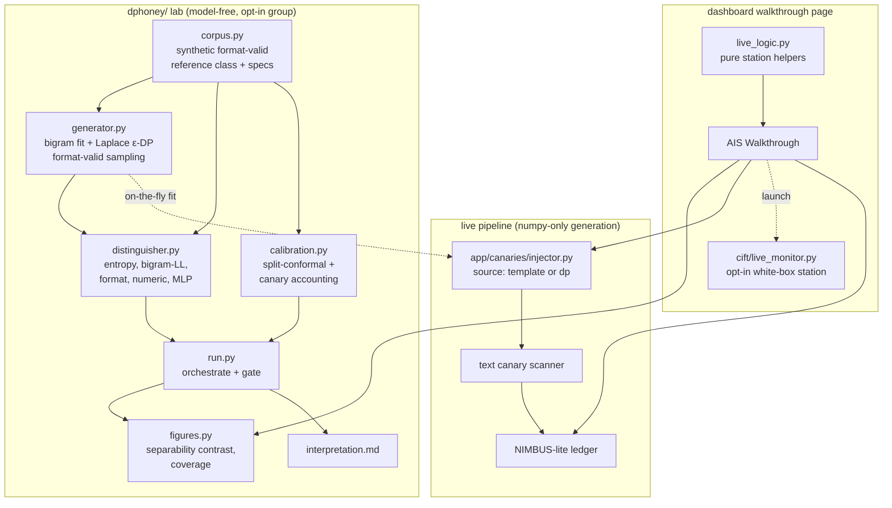

# feat: DP-HONEY pillar + AIS demo integration

## Summary

Build the paper's second research pillar, DP-HONEY, as a model-free lab that
mirrors the `cift/` package shape: a differentially-private character-bigram
canary generator, a distinguisher battery that measures whether the canaries are
separable from real-format credentials, split-conformal calibration of the
detector, and a canary-accounting relation. The headline is a contrast —
*template* canaries separate from real-format credentials, *DP* canaries should
not. Then stitch the four monitors into one demo: feed DP canaries into the live
injection path behind a template-vs-DP toggle, and add an "AIS Walkthrough"
dashboard page that walks DP-HONEY → CIFT → text backstop → NIMBUS, with CIFT as
an opt-in white-box station and NIMBUS labeled honestly as the heuristic
NIMBUS-lite.

---

## Problem Frame

The repo implements two of the paper's three pillars: the I/O half (canary
injection, transform-aware scanning, tool-call interception, heuristic
NIMBUS-lite) and CIFT (activation probing, lab plus live monitor at
`cift/live_monitor.py`). Two gaps remain for a demo that covers the paper.

First, the canary surface is the weakest piece. `app/canaries/generator.py`
builds canaries from fixed templates (`ghp_` + 36 random chars, `AKIA` + 16,
etc.) — exactly the kind the paper argues an attacker filters by prefix,
checksum, entropy, or length. DP-HONEY replaces that with canaries drawn from a
fitted statistical model and *measures* whether the swap actually helps. Unlike
CIFT, this needs no model in the loop — the generation, distinguisher, and
calibration math is pure numpy/scikit-learn, so the pillar installs without
torch and every unit is unit-testable.

Second, the monitors are three disconnected surfaces: the FastAPI pipeline, a
standalone CIFT Streamlit app, and the dashboard. Nothing tells the four-monitor
story (the paper's Figure 1) in one sitting. The integration work is a stitched
narrative — DP canaries flowing through the real injection path plus a guided
walkthrough — not a rebuilt pipeline.

---

## Requirements Trace

Origin: `docs/brainstorms/2026-06-26-dphoney-pillar-and-demo-integration-requirements.md`.

| Req | Covered by |
|---|---|
| R1 per-format bigram model | U1, U2 |
| R2 Laplace ε-DP + format-valid sampling | U2 |
| R3 DP generator as selectable canary source | U6 |
| R4 distinguisher battery | U3 |
| R5 template-vs-DP separability contrast | U3, U5 |
| R6 synthetic, format-valid reference class | U1 |
| R7 split-conformal threshold | U4 |
| R8 conformal coverage report | U4, U5 |
| R9 canary-accounting relation | U4, U7 |
| R10 single guided walkthrough | U7 |
| R11 DP canaries in the live pipeline | U6 |
| R12 CIFT as opt-in white-box station | U7 |
| R13 NIMBUS labeled as heuristic | U7 |
| R14 written interpretation | U5 |

---

## Key Technical Decisions

- **New `dphoney/` package mirroring `cift/`, but model-free.** The lab follows
  the established `cift/` split — `corpus.py` (pure data), a generator/detector
  layer (pure numpy), `figures.py` (matplotlib), `run.py` (end-to-end
  orchestration), and pure UI logic separated from rendering. There is no
  `extraction.py` equivalent because no model is loaded. This keeps each unit
  unit-testable without an opt-in stack and matches conventions an implementer
  already knows.

- **Separate `dphoney` dependency group, no torch.** DP-HONEY needs only
  `scikit-learn` (the discriminator MLP) and `matplotlib` (figures); numpy is
  already present transitively via `streamlit`. Riding the `cift` group would
  force a multi-GB torch install on a torch-free pillar, so `dphoney` gets its
  own opt-in group. The *generation* path is numpy-only and importable from the
  base FastAPI app, so live DP injection does not pull the optional group.

- **Live DP injection fits the model on the fly, not from a persisted artifact.**
  The injector fits the bigram model from a small bundled synthetic corpus at
  default ε (cached per process), rather than loading a lab-produced file, so the
  demo cannot break if the lab was never run. The live Laplace draw is **seeded**
  so the live per-format model is byte-identical to the lab's default-ε model —
  the live canaries are the exact model the lab measured, not merely the same
  procedure (Laplace noise is otherwise redrawn per fit, so an unseeded live fit
  would be a different realization than the figure shown one screen earlier, and
  could be materially more filterable in the high-noise regime). The lab still
  persists artifacts for figures and reproducibility; the live path does not
  depend on them. (see origin: Outstanding Questions)

- **Default canary source stays `template`; DP is opt-in via a toggle.** The
  injection path gains a `source: "template" | "dp"` selector surfaced through
  the playground/defenses flags, so a presenter can show the same distinguisher
  filter a template canary and fail on the DP one in one session. Existing
  callers and the default demo behavior are unchanged.

- **Unified surface is a new dashboard page that links out to the CIFT monitor.**
  The walkthrough is a new page in `dashboard/streamlit_app.py` (reusing the
  existing `st.sidebar.radio` page pattern and `/playground/run` backend), not a
  new standalone app. CIFT stays its own torch-loading Streamlit app, surfaced as
  the opt-in pre-output station with launch instructions. (see origin:
  Outstanding Questions)

- **Conformal wraps a continuous nonconformity score; the math is generic.**
  `calibration.py` operates on plain score arrays (`conformal_threshold(benign,
  alpha)`, `coverage(held_out, threshold)`), so the quantile math is testable in
  isolation. The nonconformity score is the distinguisher's bigram
  log-likelihood of the most credential-shaped substring of an output (wired via
  U3 before any coverage number is reported — a coverage figure over placeholder
  scores is not load-bearing). Conformal sets only the benign false-positive rate
  α; the miss rate β in the canary-accounting relation is an independent
  detection property the threshold does not set, and the walkthrough copy says so
  to keep the calibrated number and the accounting story from being conflated.

- **Honest-result gating mirrors CIFT.** The interpretation is gated on a
  distinguisher positive control — a deliberately separable set the battery must
  detect — so a weak DP-vs-template contrast is read as a finding, not a harness
  bug. This reuses the `cift/run.py` `build_interpretation` gating pattern.

---

## High-Level Technical Design

The lab is a linear pipeline producing the contrast figure and a gated
interpretation; the integration adds one selectable source into the existing
request pipeline and one new dashboard page that reuses existing backends.



Plain-language read: the corpus feeds both the DP generator and the distinguisher
(which compares template and DP canaries against the synthetic reference class);
`run.py` calibrates, gates, and emits the figure plus interpretation. The same
generator, fit on the fly, supplies DP canaries to the live injection path. The
walkthrough page ties the figure, a live pipeline run, a pointer to the CIFT
monitor, and the NIMBUS ledger into one narrative.

---

## Output Structure

```
dphoney/
├── __init__.py            # package docstring
├── corpus.py              # synthetic format-valid reference class + format specs (numpy only)
├── generator.py           # bigram fit + Laplace ε-DP + format-valid sampling (numpy only)
├── distinguisher.py       # entropy / bigram-LL / format / numeric / MLP battery (sklearn)
├── calibration.py         # split-conformal threshold + coverage + canary accounting (numpy)
├── figures.py             # separability-contrast + coverage plots (matplotlib)
├── live_logic.py          # pure UI helpers for the walkthrough (no streamlit import)
└── run.py                 # end-to-end: corpus → fit → distinguish → calibrate → figures → interpret
```

Artifacts (written by `run.py`, mirroring `cift/artifacts/`): `bigram_model.npz`,
`calibration.json`, `separability.png`, `coverage.png`, `interpretation.md`.

The tree is a scope declaration, not a constraint; per-unit `Files` lists are
authoritative.

---

## Implementation Units

### U1. dphoney scaffold: synthetic reference corpus + format specs

- **Goal:** Stand up the `dphoney/` package and the data layer both the generator
  and distinguisher consume: per-format specifications (prefix, length, charset)
  and a synthetic, format-valid "real credential" reference class.
- **Requirements:** R1 (partial), R6.
- **Dependencies:** none.
- **Files:**
  - Create `dphoney/__init__.py`, `dphoney/corpus.py`.
  - Modify `pyproject.toml` (add `dphoney` dependency group: `scikit-learn`,
    `matplotlib`; numpy is transitive via streamlit).
  - Test `tests/test_dphoney_corpus.py`.
- **Approach:** Reuse the six formats already in `app/canaries/generator.py`
  (`github_pat`, `stripe_key`, `aws_access_key`, `postgres_url`, `jwt_like`,
  `support_token`). A `FormatSpec` dataclass captures prefix/structure, length,
  and alphabet; `build_reference_corpus(seed, n_per_format)` returns a labeled set
  of synthetic format-valid strings per format. Load-bearing: the reference
  strings must carry **non-uniform character structure** (e.g., sampled from a
  hand-authored or seeded per-format bigram profile), deliberately distinct from
  the uniform `secrets.choice` draws `app/canaries/generator.py` uses for template
  canaries. Without this, template canaries are in-distribution for the reference
  class and the U3 contrast collapses to chance-vs-chance — there is nothing for
  the DP model to reproduce that the template violates. Pure data, deterministic
  from seed, no torch/sklearn import at module top. Mirror `cift/corpus.py`.
- **Patterns to follow:** `cift/corpus.py` (dataclasses + deterministic builders),
  `app/canaries/generator.py` (the format definitions to reproduce).
- **Test scenarios:**
  - Every generated reference string passes its own `FormatSpec` validation
    (prefix, length, charset).
  - `build_reference_corpus` is deterministic for a fixed seed and varies with
    seed.
  - All six formats are present with the requested count each.
  - `Covers R6.` Reference strings are synthetic and contain no value sourced from
    a real credential map (assert independence from `app/` runtime state).
- **Verification:** `tests/test_dphoney_corpus.py` passes under default
  `uv run pytest` (no opt-in group needed for pure-data tests that avoid sklearn).

### U2. DP generator: bigram fit + Laplace ε-DP + format-valid sampling

- **Goal:** Fit a per-format character-bigram model, add Laplace noise to the
  count table for an ε-DP guarantee, and sample format-valid canaries from it.
- **Requirements:** R1, R2.
- **Dependencies:** U1.
- **Files:**
  - Create `dphoney/generator.py`.
  - Test `tests/test_dphoney_generator.py`.
- **Approach:** `fit_bigram_counts(strings)` builds a per-format transition-count
  table; `add_laplace_noise(counts, epsilon, sensitivity)` adds `Laplace(0,
  sensitivity/epsilon)` per cell, clips at zero, applies additive smoothing to any
  all-zero row (avoid a divide-by-zero on renormalization), and renormalizes to a
  transition distribution. To keep formats valid, `sample_canary(model, spec,
  rng)` samples only each format's **free-entropy region** (the random body) from
  the chain while **templating the fixed prefix/scaffolding** (e.g.
  `postgres://ais_user:…@db.local:…`), with an explicit retry cap and a defined
  on-exhaustion fallback to a format-valid completion. Keep math in numpy float64.
  `fit_dp_model(corpus, epsilon)` returns a per-format model bundle; the live path
  (U6) fits with a fixed seed and a process-level cache. **Sensitivity:** under
  the credential-level neighboring relation (add/remove one credential), one
  credential of length L contributes up to L−1 bigram increments, so the ℓ1
  sensitivity of the per-format count vector is `max_length − 1`, not 1 — set the
  Laplace scale to `(max_length − 1)/ε` (or cap each credential's contribution to
  the table and use the cap). Report the effective per-format ε in
  `interpretation.md`; ε-DP is on the released count model, not a claim of
  indistinguishability from real credentials.
- **Patterns to follow:** `cift/detector.py` (numpy float64, `.npz` save/load with
  fingerprint sidecar) for `save_model`/`load_model`.
- **Technical design (directional, not spec):**
  ```
  counts[c_prev, c_next] += 1                      # per format
  sensitivity = max_length - 1                     # ℓ1, per credential added/removed
  noisy = max(0, counts + Laplace(0, sensitivity/epsilon)); smooth all-zero rows
  probs = noisy / noisy.sum(axis=1, keepdims=True)
  sample free-entropy region from probs; template the fixed prefix/scaffolding
  ```
- **Test scenarios:**
  - Sampled canaries pass the format spec for every format (including structured
    formats like `postgres_url` whose scaffolding is templated, not sampled).
  - Sampling exhaustion: when the chain cannot satisfy the spec within the retry
    cap, the defined fallback returns a format-valid string (no exception, no
    unbounded loop).
  - Smaller ε produces a larger noise scale (assert scale = sensitivity/ε
    monotonic) and more deviation from the un-noised distribution.
  - `Covers R2.` ε-DP sensitivity: the ℓ1 change to the released per-format count
    vector from adding/removing one credential is at most `max_length − 1`, and
    the Laplace scale is set to that sensitivity / ε (test the count-table
    construction and the scale, not the privacy proof).
  - An all-zero transition row is smoothed rather than producing NaN on
    renormalization.
  - Fixed seed → reproducible canaries; different seed → different canaries.
  - `save_model`/`load_model` round-trips the per-format tables.
- **Verification:** generator tests pass; `fit_dp_model(corpus, epsilon).sample()`
  yields format-valid strings for all six formats.

### U3. Distinguisher battery + positive control

- **Goal:** Measure how separable a canary source is from the reference class via
  a battery of tests, and produce the template-vs-DP contrast.
- **Requirements:** R4, R5.
- **Dependencies:** U1, U2.
- **Files:**
  - Create `dphoney/distinguisher.py`.
  - Test `tests/test_dphoney_distinguisher.py`.
- **Approach:** Implement per-string features — character entropy, bigram
  log-likelihood under a reference model, format-validation flag, numeric-
  substring statistics — and a `scikit-learn` `MLPClassifier` discriminator
  trained to separate a canary source from the reference class, reported as
  held-out AUROC/accuracy. `evaluate_source(reference, canaries)` returns a
  `Separability` dataclass (per-test scores + discriminator AUROC).
  `run_contrast(reference, template_canaries, dp_canaries)` returns both, with the
  DP score expected at/near chance and template above it. Two controls gate
  interpretation: (1) a **battery positive control** — a deliberately rigged
  distinguishable set the battery must separate (AUROC ≥ a floor), proving the
  battery works; and (2) a **headline left-half control** — template canaries must
  separate from the reference class above chance, proving the reference corpus
  carries the structure the contrast needs (U1). The rigged control does not
  verify the left half; without control (2) a structureless reference would
  silently produce chance-vs-chance and read as a null finding. A weak
  DP-vs-template gap, with both controls passing, is recorded as a finding, not
  failed.
- **Patterns to follow:** `cift/evaluate.py` (split pure scoring from
  orchestration; `ControlResult`-style gating), `cift/detector.py`
  (`evaluate_metrics` AUROC/F1 helper — reuse or mirror, do not duplicate if
  importable).
- **Test scenarios:**
  - `Covers R4.` Each battery test returns a bounded, finite score on
    reference/canary inputs.
  - `Covers AE1.` On a structured reference class, uniform-random template
    canaries separate above chance (left-half control) while a source drawn from
    the same structure scores near chance — the contrast exists.
  - `Covers R5.` On a synthetic rigged case (canaries with an obvious prefix
    artifact), the discriminator AUROC is materially above 0.5.
  - On near-identical distributions, discriminator AUROC is near 0.5 (no false
    separation).
  - Both controls behave: the battery control passes on a must-separate set and
    flags an inseparable set; the left-half control flags a structureless
    reference corpus.
  - `run_contrast` returns separability for both sources without raising when DP
    and template are close.
- **Verification:** distinguisher tests pass; `run_contrast` produces a template
  score and a DP score on synthetic inputs.

### U4. Split-conformal calibration + canary accounting

- **Goal:** Calibrate the canary detector threshold by split conformal prediction
  and surface the canary-accounting relation.
- **Requirements:** R7, R8, R9.
- **Dependencies:** U1, U3 (the nonconformity score source).
- **Files:**
  - Create `dphoney/calibration.py`.
  - Test `tests/test_dphoney_calibration.py`.
- **Approach:** `conformal_threshold(benign_scores, alpha)` returns the
  empirical `1 - alpha` quantile using the standard finite-sample index
  `ceil((n+1)(1-alpha)) / n`; `coverage(held_out_benign_scores, threshold)`
  returns the empirical fraction at or below threshold; a `calibrate(...)` wrapper
  reports conformal coverage alongside a no-conformal baseline for contrast.
  `detection_probability(k, m, beta)` implements `Pr(detect) = k/(m+k)·(1−β)`.
  The quantile/coverage/accounting functions operate on plain numpy
  arrays/scalars (testable in isolation), but the coverage number reported in the
  lab is computed over a **real** nonconformity score — the distinguisher's bigram
  log-likelihood of the most credential-shaped substring (from U3) on benign vs
  leaked-canary outputs — not placeholder scores. Note in code and copy that
  conformal sets α (benign FPR) while β is an independent detection property.
  Mirror `operating_point_from_benign_scores` in `cift/detector.py`.
- **Patterns to follow:** `cift/detector.py`
  `operating_point_from_benign_scores` and its `save_operating_point`/
  `load_operating_point` JSON pattern for `calibration.json`.
- **Test scenarios:**
  - `Covers AE2.` On synthetic benign scores, conformal coverage on a disjoint
    benign set lands near the target (e.g., 0.99 ± tolerance), mirroring
    `test_operating_point_threshold_matches_target_fpr`.
  - The conformal quantile index matches the closed-form for small n (boundary:
    n=1, α at the extremes).
  - `Covers R9.` `detection_probability` edge cases: k=0 → 0; β=0 → k/(m+k);
    β=1 → 0; monotonic increasing in k.
  - Calibration JSON round-trips threshold + coverage + alpha.
- **Verification:** calibration tests pass; `calibrate` returns a coverage number
  at the target.

### U5. Figures + run orchestration + gated interpretation

- **Goal:** Wire the lab end to end and emit the contrast figure, coverage, and a
  gated written interpretation.
- **Requirements:** R5, R8, R14; Flow F1.
- **Dependencies:** U2, U3, U4.
- **Files:**
  - Create `dphoney/figures.py`, `dphoney/run.py`.
  - Test `tests/test_dphoney_figures.py`, `tests/test_dphoney_run.py`.
- **Approach:** `figures.plot_separability_contrast(template, dp, path)` draws
  grouped bars (template vs DP discriminator score, plus per-test scores);
  `figures.plot_coverage(no_conformal, conformal, target, path)` shows coverage
  versus target. `run.main()` orchestrates: build corpus → `fit_dp_model` at a
  single default ε → generate template and DP canaries → `run_contrast` →
  `calibrate` → figures → write `interpretation.md`. (An ε sweep stays in Deferred
  to Follow-Up.)
  `build_interpretation(control, contrast, coverage, epsilon)` is a pure function
  gated on the distinguisher positive control — a failed control yields a
  "not interpretable, fix the harness" message; a passing control reads the
  DP-vs-template gap and states the ε-DP scope caveat honestly. Mirror
  `cift/run.py`.
- **Patterns to follow:** `cift/run.py` (`build_interpretation` gating + `main`
  orchestration; `matplotlib.use("Agg")` headless in `cift/figures.py`).
- **Execution note:** Implement `build_interpretation` test-first — its gating
  logic (refusing to read a null contrast when the control failed) is the
  load-bearing honesty guarantee and is pure/unit-testable.
- **Test scenarios:**
  - `Covers R14.` `build_interpretation` with a failed control returns the
    not-interpretable message and does not report the contrast as a finding.
  - With a passing control and a strong gap, the interpretation names the
    template-vs-DP separability and the ε used.
  - With a passing control and a weak gap, the interpretation records it as a
    finding (no failure), and states the ε-DP scope caveat.
  - Figure functions write a non-empty `.png` from synthetic inputs (Agg backend,
    no display).
  - `run.main` writes all artifacts to the artifacts dir (smoke test with a tiny
    corpus; no model needed).
- **Verification:** `uv run --group dphoney python -m dphoney.run` writes all
  artifacts (`bigram_model.npz`, `calibration.json`, `separability.png`,
  `coverage.png`, `interpretation.md`); the figure shows the template-vs-DP
  contrast.

### U6. Wire DP canaries into the live injection path (toggle)

- **Goal:** Let the live pipeline inject DP-generated canaries behind a
  template-vs-DP toggle, defaulting to template.
- **Requirements:** R3, R11; Acceptance Example AE3.
- **Dependencies:** U2.
- **Files:**
  - Create `app/canaries/dp_source.py` (numpy-only DP adapter wrapping
    `dphoney.generator`), modify `app/canaries/injector.py`.
  - Thread the toggle through the typed request: the defense-config schema
    (`app/schemas/`), the request normalizer, the playground route and
    `app/api/chat.py` (both build the same metadata), and the proxy call site
    `app/proxy/responses_proxy.py` that invokes `inject_canaries`.
  - Test `tests/test_dphoney_injection.py` (and extend
    `tests/test_canary_injector.py`).
- **Approach:** Add `source: "template" | "dp" = "template"` to the
  generate/inject path. The DP path calls a numpy-only `dphoney.generator`
  helper (`fit_dp_model` seeded + cached at module level, default ε) to sample one
  format-valid canary for the **same format set the template default injects**
  (`CANARY_FORMATS[:5]`), then flows through the existing `GeneratedCanary` →
  `repository.add_canary` → event path unchanged. If DP sampling fails (retry cap
  exhausted, U2), fall back to the template canary for that format so the live
  request cannot 500. Surface the toggle as a defense/playground flag so the
  Attack Playground selectbox can pick it. Keep all existing call sites working
  with the default.
- **Patterns to follow:** `app/canaries/injector.py` (`generate_canaries` →
  `add_canary` loop), the playground defenses-flag handling in
  `dashboard/streamlit_app.py` `attack_playground` and its backend route.
- **Test scenarios:**
  - `Covers AE3.` Injecting with `source="dp"` yields a format-valid DP canary,
    and the existing text scanner still detects it when leaked verbatim.
  - Default `source="template"` reproduces current behavior byte-for-byte
    (existing injector tests still pass).
  - The DP path injects the same format set as the template default
    (`CANARY_FORMATS[:5]`), not a different count.
  - A simulated DP sampling failure falls back to a template canary; the request
    succeeds (no 500).
  - The DP path stores the canary and emits the `canary.injected` event
    identically to the template path (only the value differs).
  - DP injection imports no torch/sklearn (assert the live path stays light).
- **Verification:** a playground run with the DP toggle injects DP canaries
  visible in the Canary Registry; `tests/test_dphoney_injection.py` passes.

### U7. AIS Walkthrough dashboard page + honest NIMBUS labeling + docs

- **Goal:** Add one guided entry point that walks the four monitors, and label
  NIMBUS honestly as the heuristic stand-in.
- **Requirements:** R9, R10, R12, R13; Flow F2.
- **Dependencies:** U5, U6.
- **Files:**
  - Modify `dashboard/streamlit_app.py` (new `ais_walkthrough()` page + sidebar
    entry).
  - Create `dphoney/live_logic.py` (pure helpers: accounting calculator, station
    copy) and `tests/test_dphoney_live_logic.py`.
  - Modify `README.md` (run commands: `uv sync --group dphoney`,
    `python -m dphoney.run`, walkthrough launch).
- **Approach:** A new sidebar page renders the four stations as a **single
  vertical scroll** with anchored section headers, in order. A **single** run action
  drives the whole pipeline: a button injects a DP canary via `/playground/run`
  with the U6 toggle, shows a spinner while the call is in flight, surfaces
  failures with `st.error` (never a raw traceback), and on success stores the
  result in `st.session_state` so it survives Streamlit reruns and populates the
  downstream stations. Each station has a defined pre-run / empty state. DP-HONEY
  station: `dphoney/artifacts/separability.png` (graceful "run the lab first" note
  if absent) and an interactive canary-accounting calculator (β a `[0.0, 1.0]`
  float slider, k and m small integer sliders `0–50`, calling
  `dphoney.calibration.detection_probability`). CIFT station: explain pre-output
  gating and show the launch command for `cift/live_monitor.py` as the opt-in
  white-box station — no inline model load. (The single-scroll choice reconciles
  the origin's "screen-to-screen narrative" framing for F2 as one scrolling page,
  not a wizard.) Text-backstop station: the scanner verdict from the run, or "no
  scenario run yet" before the first run. NIMBUS
  station: the cumulative ledger (reusing the existing leakage-ledger view), or an
  empty-ledger state before the first run, with copy that names it NIMBUS-lite and
  distinguishes it from the paper's InfoNCE estimator. Keep pure copy/number logic
  in `dphoney/live_logic.py` so it is testable without streamlit (mirrors
  `cift/live_logic.py`).
- **Patterns to follow:** `dashboard/streamlit_app.py` (`st.sidebar.radio` page
  map, `api_get`/`/playground/run` integration, `leakage_ledger` view to reuse),
  `cift/live_logic.py` (pure UI helpers, no overclaiming).
- **Test scenarios:**
  - `Covers R9.` The accounting calculator helper returns correct
    `Pr(detect)` across slider ranges (delegates to U4; assert the wiring).
  - `Covers R13.` The NIMBUS station copy explicitly states it is heuristic
    NIMBUS-lite, not the InfoNCE estimator (assert the label string is present).
  - Each station's pre-run state helper returns its empty-state copy (DP-HONEY
    "run the lab first"; text-backstop "no scenario run yet"; NIMBUS empty
    ledger) — no station renders blank or raises before the first run.
  - The DP-HONEY station degrades gracefully when the artifact PNG is missing
    (returns the "run the lab" guidance, no exception).
  - A run result held in session state threads into the text-backstop and NIMBUS
    station view models (one run drives all downstream stations).
  - Station ordering helper returns DP-HONEY → CIFT → text → NIMBUS.
  - `Test expectation: none -- streamlit page wiring` for the render function
    itself; behavior lives in the tested `live_logic` helpers.
- **Verification:** `uv run streamlit run dashboard/streamlit_app.py` shows the
  "AIS Walkthrough" page walking all four stations; README documents the demo
  run path.

---

## Scope Boundaries

### Deferred for later

- Real InfoNCE NIMBUS (learned bits-based cumulative estimator) — its own pillar.
- Evasion-suite breadth (Unicode homoglyphs, leet, fragmentation, paraphrase,
  reverse, partial reproduction) beyond what CIFT and the text scanner cover.
- Multi-session leakage state (the paper's "restart session to reset the budget"
  attack) — NIMBUS stays per-session.
- Public prompt-injection benchmarks (TensorTrust, InjecAgent, BIPIA, AgentDojo).
- A fully-live single pipeline where every request runs the white-box model so
  CIFT gates inline per Algorithm 1.

### Outside this product's identity

- Real (non-fake) credentials, cloud/GPU training, deployment, multi-user
  hosting, product/UI polish. Standing constraint: all credentials fake, all
  tools local.
- The stubbed live model adapters (OpenAI, Ollama) stay stubbed.

### Deferred to Follow-Up Work

- Persisting the live DP model as a shared artifact (the live path fits on the
  fly by decision); revisit only if fit cost ever matters.
- An ε-sweep visualization beyond the single contrast figure, if the demo wants a
  privacy/utility tradeoff chart à la the paper's budget-sensitivity figure.

---

## System-Wide Impact

- **Dependency surface:** a new opt-in `dphoney` group (`scikit-learn`,
  `matplotlib`). The base FastAPI install stays torch-free and sklearn-free; only
  the lab and the distinguisher need the group. The live injection path uses
  numpy-only generation.
- **Injection path:** `app/canaries` gains a `source` parameter with a
  `template` default — existing callers and the default demo are unchanged.
- **Dashboard:** one new page added to the existing sidebar map; existing pages
  untouched. The CIFT live monitor remains a separate app.

---

## Risks & Dependencies

- **The DP-vs-template contrast may be weak on a small corpus.** Mitigation: the
  interpretation is gated on a positive control and treats a weak gap as a
  documented finding (origin's honesty stance). First responses are to enrich the
  fitting corpus or relax over-rigid format constraints, not to abandon the
  contrast.
- **Format-validity constraints can dominate the bigram signal.** Heavily
  structured formats (e.g., `postgres_url`) leave little free entropy for the
  model to shape, so they may stay distinguishable. Mitigation: report per-format
  separability so the contrast is read per format, not as one aggregate.
- **ε-DP is easy to overclaim — both scope and magnitude.** The guarantee is on
  the released bigram-count model, not indistinguishability from real credentials;
  and the per-format ℓ1 sensitivity is `max_length − 1`, not 1, so the Laplace
  scale must use it or the displayed ε overstates the true privacy. Mitigation: U2
  sets the sensitivity correctly and the interpretation reports the effective
  per-format ε and the scope caveat.
- **A structureless reference class would fake a null result.** If the synthetic
  reference corpus is uniform-random like the template generator, template
  canaries are in-distribution and the headline contrast collapses to
  chance-vs-chance — looking like an honest DP win when nothing was measured.
  Mitigation: U1 builds non-uniform reference structure and U3's left-half control
  fails loudly if template canaries do not separate.
- **Reported coverage is only as real as its score.** The conformal coverage
  number is meaningful only over the actual nonconformity score (U3's bigram-LL),
  not the synthetic placeholders the quantile math is unit-tested on. Mitigation:
  U4 depends on U3 and the lab computes coverage over the real score before
  reporting it.

---

## Open Questions

### Deferred to Planning (resolved)

- Package location → new `dphoney/` package mirroring `cift/` (KTD).
- Walkthrough form → new dashboard page linking out to the CIFT monitor (KTD).
- Live CIFT gate hook → not added; CIFT stays the separate opt-in station (KTD).
- Live DP source → on-the-fly fit, not a persisted artifact (KTD).

### Deferred to Implementation

- The substring-selection detail for the nonconformity score — the score itself
  is chosen (the distinguisher's bigram log-likelihood of the most
  credential-shaped substring, wired in U4 via U3); the exact "most
  credential-shaped substring" heuristic is settled at implementation.
- Default ε for the demo (single value; the sweep is deferred), tuned for a
  legible contrast.
- Corpus sizes: synthetic strings per format for fitting, and the
  reference/calibration set sizes.

---

## Sources & Research

- Paper `docs/2606.04141v1.pdf` — §4.3 DP-HONEY (character bigram + Laplace ε-DP,
  conformal calibration, distinguisher tests, canary accounting
  `Pr(detect)=k/(m+k)(1−β)`), Table 2 (coverage target 0.99), Figure 1
  (four-monitor architecture), §4.1 + Algorithm 1 (integrated pipeline).
- Origin requirements:
  `docs/brainstorms/2026-06-26-dphoney-pillar-and-demo-integration-requirements.md`.
- Lab skeleton to mirror: `cift/run.py` (orchestration + gated interpretation),
  `cift/detector.py` (numpy fit/score, `.npz`/`.json` artifacts, operating point),
  `cift/corpus.py` (deterministic builders), `cift/figures.py` (Agg backend),
  `cift/live_logic.py` (pure UI helpers).
- Canary surface to upgrade: `app/canaries/generator.py` (template formats to
  reproduce), `app/canaries/injector.py` (injection path), `app/canaries/registry.py`.
- Demo surface: `dashboard/streamlit_app.py` (sidebar page map, `/playground/run`
  integration, leakage-ledger view), `cift/live_monitor.py` (separate app launch).
- Institutional learning:
  `docs/solutions/best-practices/activation-probe-experiment-validity.md`
  (positive-control gating, confound control, honest-null stance — applied to the
  distinguisher control here).
- Test + tooling conventions: opt-in model-test gating pattern in
  `tests/test_cift_extraction.py`; ruff line-length 100; `uv run pytest` skips
  opt-in groups by default.
</content>
